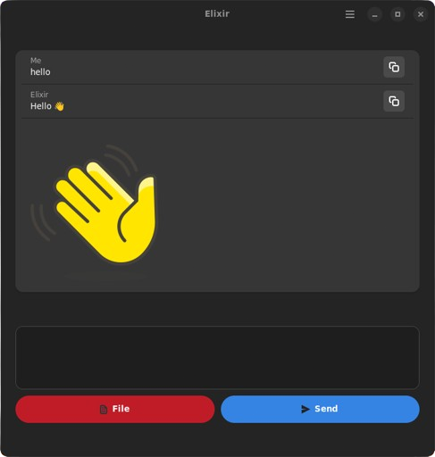

# Elixir
Elixir is a Large Language Model (LLM) based agent for generating user content. It is able to answer queries and make suggestions based on a given corpus of text.
<br>



## Installation

Run the following commands to download and set up the project:

```bash
  git clone https://github.com/Puneeth-A-R/Elixir.git
  cd Elixir
  pip install -r requirements.txt
```
Run the following command to start the server:

```bash      
uvicorn main:app --reload

## Literature survey 

| **#** | **Title** | **Year** | **Authors** | **Paper Link** |
| --- | --- | --- | --- | --- |
| 1 | A Comprehensive Overview of Large Language Models | 2023 | Humza Naveed, Asad Ullah Khan, Shi Qiu2, Muhammad Saqib, Saeed Anwar, Muhammad Usman, Naveed Akhtar, Nick Barnes, Ajmal Mian | [Link](https://arxiv.org/pdf/2307.06435.pdf) |
| 2 | Attention Is All You Need | 2023 | Ashish Vaswani, Noam Shazeer, Niki Parmar, Jakob Uszkoreit, Llion Jones, Aidan N. Gomez, Łukasz Kaiser, Illia Polosukhin | [Link](https://arxiv.org/pdf/1706.03762.pdf) |
| 3 | Improving alignment of dialogue agents via targeted human judgments | 2022 | Amelia Glaese, Nat McAleese, Maja Trebacz, John Aslanides, Vlad Firoiu, Timo Ewalds, Maribeth Rauh, Laura Weidinger, Martin Chadwick, Phoebe Thacker, et al. | [Link](https://arxiv.org/pdf/2209.14375.pdf) |
| 4 | TEAL: TOKENIZE AND EMBED ALL FOR MULTI-MODAL LARGE LANGUAGE MODELS | 2023 | Zhen Yang, Yingxue Zhang, Fandong Meng, Jie Zhou | [Link](https://arxiv.org/pdf/2311.04589.pdf) |
| 5 | Processing Data for Large Language Models | 2022 | Bharat Ramanathan | [Link](https://wandb.ai/wandb_gen/llm-data-processing/reports/Processing-Data-for-Large-Language-Models--VmlldzozMDg4MTM2) |
| 6 | Full Parameter Fine-Tuning for Large Language Models With Limited Resources | 2023 | Kai Lv, Yuqing Yang, Tengxiao Liu, Qinghui Gao, Qipeng Guo, Xipeng Qiu | [Link](https://arxiv.org/pdf/2306.09782.pdf) |
| 7 | BERT: Pre-training of Deep Bidirectional Transformers for Language Understanding | 2019 | Jacob Devlin, Ming-Wei Chang, Kenton Lee, Kristina Toutanova | [Link](https://arxiv.org/pdf/1810.04805.pdf) |
| 8 | LaMDA: Language Models for Dialog Applications | 2022 | Romal Thoppilan, Daniel De Freitas, Jamie Hall, Noam Shazeer, Apoorv Kulshreshtha, Heng-Tze Cheng, Alicia Jin, Taylor Bos, Leslie Baker, Yu Du, et al. | [Link](https://arxiv.org/pdf/2201.08239.pdf) |
| 9 | LLM-Adapters: An Adapter Family for Parameter-Efficient Fine-Tuning of Large Language Models | 2023 | Zhiqiang Hu, Lei Wang, Yihuai Lan Wanyu Xu, Ee-Peng Lim, Lidong Bing, Xing Xu, Soujanya Poria, Roy Ka-Wei Lee | [Link](https://arxiv.org/pdf/2304.01933.pdf) |
| 10 | Enhancing LLM with Evolutionary Fine Tuning for News Summary Generation | 2023 | Le Xiao, Xiaolin Chen | [Link](https://arxiv.org/pdf/2307.02839.pdf) |
| 11 | Cramming: Training a Language Model on a Single GPU in One Day | 2022 | Jonas Geiping, Tom Goldstein | [Link](https://arxiv.org/pdf/2212.14034.pdf) |
| 12 | Training language models to follow instructions with human feedback | 2022 | Long Ouyang, Jeff Wu, Xu Jiang, Diogo Almeida, Carroll L. Wainwright, Pamela Mishkin, Chong Zhang, Sandhini Agarwal, Katarina Slama, Alex Ray, et al. | [Link](https://arxiv.org/pdf/2203.02155.pdf) |
| 13 | BLOOM: A 176B-Parameter Open-Access Multilingual Language Model | 2022 | Teven Le Scao, Angela Fan, Christopher Akiki, Ellie Pavlick, Suzana Ili´c, Daniel Hesslow, Roman Castagné, Alexandra Sasha Luccioni, François Yvon, et al. | [Link](https://arxiv.org/pdf/2211.05100.pdf) |
| 14 | Llama 2: Open Foundation and Fine-Tuned Chat Models | 2023 | Hugo Touvron, Louis Martin, Kevin Stone, Peter Albert, Amjad Almahairi, Yasmine Babaei, Nikolay Bashlykov, Soumya Batra, Prajjwal Bhargava, Shruti Bhosale, et al. | [Link](https://arxiv.org/pdf/2307.09288.pdf) |
| 15 | On the Effectiveness of Fine-tuning Versus Meta-reinforcement Learning | 2022 | Zhao Mandi, Pieter Abbeel, Stephen James | [Link](https://arxiv.org/pdf/2206.03271.pdf) |
| 16 | Active Retrieval Augmented Generation | 2023 | Zhengbao Jiang, Frank F. Xu, Luyu Gao, Zhiqing Sun, Qian Liu, Jane Dwivedi-Yu, Yiming Yang, Jamie Callan, Graham Neubig | [Link](https://arxiv.org/pdf/2305.06983.pdf) |
| 17 | A Survey on Retrieval-Augmented Text Generation | 2022 | Huayang Li, Yixuan Su, Deng Cai, Yan Wang, Lemao Liu | [Link](https://arxiv.org/pdf/2202.01110.pdf) |
| 18 | Sparks of Artificial General Intelligence: Early experiments with GPT-4 | 2023 | S´ebastien Bubeck, Varun Chandrasekaran, Ronen Eldan, Johannes Gehrke, Eric Horvitz, Ece Kamar, Peter Lee, Yin Tat Lee, Yuanzhi Li, Scott Lundberg, et al. | [Link](https://arxiv.org/pdf/2303.12712.pdf) |
| 19 | HuggingGPT: Solving AI Tasks with ChatGPT and its Friends in Hugging Face | 2023 | Yongliang Shen, Kaitao Song, Xu Tan, Dongsheng Li, Weiming Lu, Yueting Zhuang | [Link](https://arxiv.org/abs/2303.17580) |
| 20 | API-Bank: A Comprehensive Benchmark for Tool-Augmented LLMs | 2023 | Yongliang Shen, Kaitao Song, Xu Tan, Dongsheng Li, Weiming Lu, Yueting Zhuang | [Link](https://arxiv.org/pdf/2304.08244.pdf) |
| 21 | Chain-of-Thought Prompting Elicits Reasoning in Large Language Models | 2022 | Jason Wei, Xuezhi Wang, Dale Schuurmans, Maarten Bosma, Brian Ichter, Fei Xia, Ed Chi, Quoc Le, Denny Zhou | [Link](https://arxiv.org/pdf/2201.11903.pdf) |
| 22 | Tree of Thoughts: Deliberate Problem Solving with Large Language Models | 2023 | Shunyu Yao, Dian Yu, Jeffrey Zhao, Izhak Shafran, Thomas L. Griffiths, Yuan Cao, Karthik Narasimhan | [Link](https://arxiv.org/pdf/2305.10601.pdf) |
| 23 | LLM+P: Empowering Large Language Models with Optimal Planning Proficiency | 2023 | Bo Liu, Yuqian Jiang, Xiaohan Zhang, Qiang Liu, Shiqi Zhang, Joydeep Biswas, Peter Stone | [Link](https://arxiv.org/pdf/2304.11477.pdf) |
| 24 | ReAct: Synergizing Reasoning and Acting in Language Models | 2023 | Shunyu Yao, Jeffrey Zhao, Dian Yu, Nan Du, Izhak Shafran, Karthik Narasimhan, Yuan Cao | [Link](https://arxiv.org/pdf/2210.03629.pdf) |
| 25 | Chain of Hindsight Aligns Language Models with Feedback | 2023 | Hao Liu, Carmelo Sferrazza, Pieter Abbeel | [Link](https://arxiv.org/pdf/2302.02676.pdf) |
